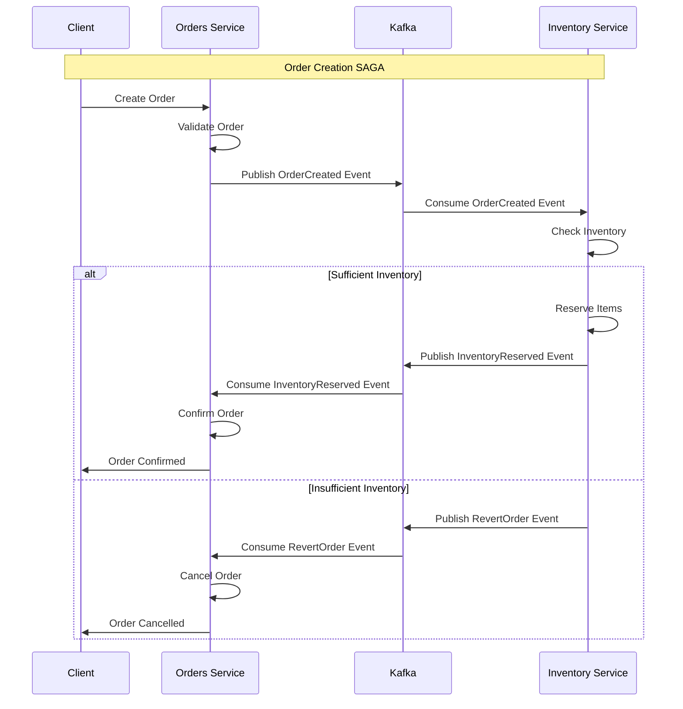
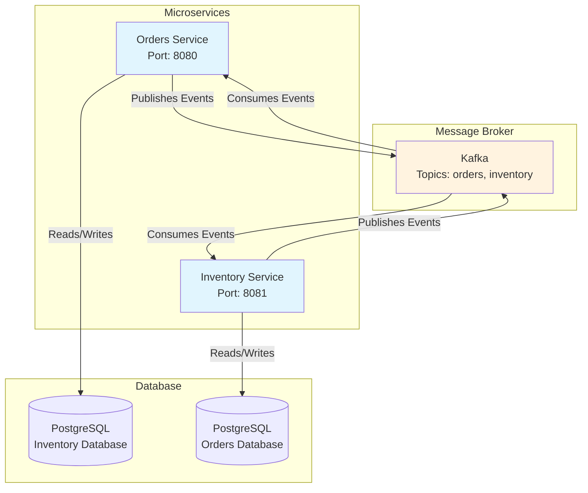
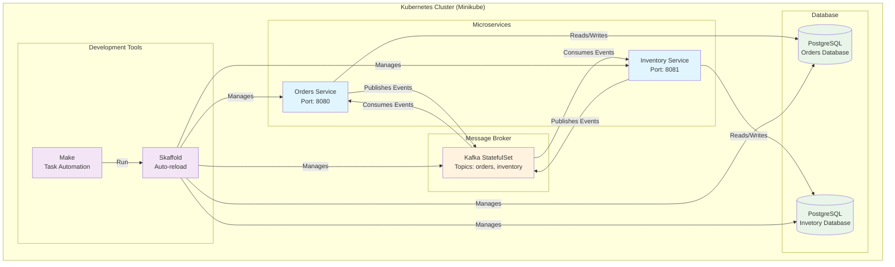
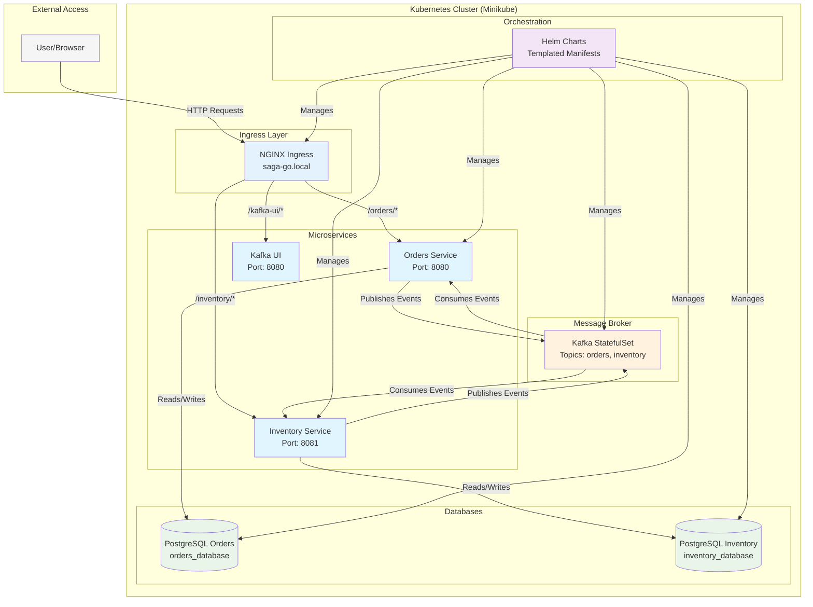

# SAGA Pattern implemented in Go

This is an example of how a [SAGA Pattern](https://medium.com/cloud-native-daily/microservices-patterns-part-04-saga-pattern-a7f85d8d4aa3) can be implemented using an Choreography structure in Go. This is purely educational.

This project will also showcase (using different branches) how we can simplify the life of the developer experience with the introduction of tools such as Skaffold, Helm and Make.

## 🔄 **SAGA Pattern Flow**

The SAGA pattern ensures distributed transactions across microservices using event-driven choreography. When an order is created, the inventory is checked through messages, and if not available, the order is cancelled:




## 🏗️ **Project Structure**

For this project, we are going to show a minimal setup of 2 microservices:
- **Order Service**: Service in charge of handling all the orders that are made to our restaurant
- **Inventory Service**: Service in charge of handling all the deliveries to the user

## 🚀 **How to run it?**

> [!IMPORTANT]
> On every branch you can find the SAGA pattern implemented the same way, the only thing that will change is our toolset

This is a complex question as you may think, but these are the steps depending on the branch that you are placed:

---

## 🔧 **Basic tooling (branch `barebones-approach`)**

### 🎯 **What's in This Branch:**
- **Docker Compose**: Simple container orchestration for development
- **Basic Setup**: Minimal configuration for local development
- **Volume Management**: Database persistence with Docker volumes

### 📦 **Prerequisites**

```bash
# Install Docker and Docker Compose
# (Installation instructions vary by OS)
```

### 🎯 **Quick Start**

```bash
# Run our application without cleaning the databases
bash tooling/run-app.sh

# Run our application cleaning the database (cleaning volumes)
bash tooling/run-app.sh -c / --clean
```

### 🔧 **Available Scripts**

| Script | Purpose | Usage |
|--------|---------|-------|
| `tooling/run-app.sh` | Start the application | `bash tooling/run-app.sh` |
| `tooling/run-app.sh -c` | Start with clean databases | `bash tooling/run-app.sh -c / --clean` |


### 🌐 **Service Architecture**



### 📋 **Service Endpoints**

| Service | URL | Description |
|---------|-----|-------------|
| Orders API | `http://localhost:8080` | Order management endpoints |
| Inventory API | `http://localhost:8081` | Inventory management endpoints |

### ⚙️ **Configuration**

The application uses Docker Compose with the following services:
- PostgreSQL database for each service
- Orders microservice
- Inventory microservice
- Kafka message broker

### 🧹 **Cleanup**

```bash
# Stop all containers
docker-compose down

# Stop and remove volumes
docker-compose down -v

# Remove all containers and images
docker-compose down --rmi all --volumes --remove-orphans
```

### 🎉 **Benefits of This Approach**

- ✅ **Simple Setup**: Easy to understand and get started
- ✅ **Docker Compose**: Familiar container orchestration
- ✅ **Quick Development**: Fast iteration cycles
- ✅ **Volume Persistence**: Data survives container restarts

---

## 🛠️ **Easier Developer Experience (branch `easier-dev-xp`)**

### 🎯 **What's in This Branch:**

- **Skaffold**: Automated development workflow
- **Make**: Build automation and task management
- **Kubernetes (Minikube)**: Container orchestration platform
- **Automated Dependencies**: Automatic dependency checking and installation

### 📦 **Prerequisites**

```bash
# Install dependencies (automated)
make install-dependencies

# This will check and install:
# - Docker
# - Minikube
# - kubectl
# - Skaffold
# - Make
```

### 🎯 **Quick Start**

> [!IMPORTANT]
> You must run the following command before making any docker related stuff 

```bash
skaffold config set --global local-cluster true
eval $(minikube -p custom docker-env)
```

To build and deploy just run:
```bash
make dev
```

### 🔧 **Available Commands**

| Command | Purpose | Usage |
|---------|---------|-------|
| `make install-dependencies` | Install required tools | `make install-dependencies` |
| `make dev` | Start development environment | `make dev` |
| `make clean` | Clean up resources | `make clean` |
| `make logs` | View application logs | `make logs` |

### 🌐 **Service Architecture**



### 📋 **Service Endpoints**

| Service | URL | Description |
|---------|-----|-------------|
| Orders API | `http://{{minikueIP}}:30080` | Order management endpoints |
| Inventory API | `http://{{minikueIP}}:30081` | Inventory management endpoints |

### ⚙️ **Configuration**

Skaffold configuration in `skaffold.yaml`:
```yaml
apiVersion: skaffold/v2beta29
kind: Config
build:
  artifacts:
    - image: orders-image
      docker:
        dockerfile: docker/orders-command/orders.dockerfile
    - image: inventory-image
      docker:
        dockerfile: docker/inventory-command/inventory.dockerfile
deploy:
  kubectl:
    manifests:
      - k8s/orders-deployment.yaml
      - k8s/inventory-deployment.yaml
      - k8s/postgres-deployment.yaml
      - k8s/kafka-deployment.yaml
```

### 🔄 **Development Workflow**

```bash
# Start development (auto-reload on changes)
make dev
```

### 🧹 **Cleanup**

```bash
# Stop Skaffold
Ctrl+C (in the make dev terminal)

# Stop Minikube
minikube stop
```

### 🎉 **Benefits of This Approach**

- ✅ **Automated Workflow**: Skaffold handles build and deploy
- ✅ **Hot Reload**: Automatic rebuilds on code changes
- ✅ **Kubernetes Native**: Real container orchestration
- ✅ **Task Automation**: Make simplifies common tasks
- ✅ **Dependency Management**: Automatic tool installation

---

## 🎯 **Don't want to repeat, let's template (branch `helm-is-here`)**

### 🎯 **What's in This Branch:**

- **Helm Charts**: Templated Kubernetes manifests with configurable values
- **Ingress Controller**: Path-based routing for microservices
- **Automated Setup Scripts**: One-command deployment and configuration
- **Separate Databases**: Each microservice has its own PostgreSQL instance
- **Kafka Integration**: Message broker for SAGA pattern communication

### 📦 **Prerequisites**

```bash
# Install Helm (if not already installed)
curl https://raw.githubusercontent.com/helm/helm/main/scripts/get-helm-3 | bash

# Start Minikube and enable ingress
minikube start
minikube addons enable ingress
```

### 🎯 **Quick Start**

#### **Option 1: Manual Step-by-Step**
```bash
# 1. Deploy the Helm chart
cd k8s
helm install saga-go .

# 2. Set up ingress hosts
sudo ./setup-ingress.sh

# 3. Access your services
# Orders API: http://saga-go.local/orders
# Inventory API: http://saga-go.local/inventory
# Kafka UI: http://saga-go.local/kafka-ui
```

### 🔧 **Available Scripts**

| Script | Purpose | Usage |
|--------|---------|-------|
| `setup-ingress.sh` | Setup ingress hosts only | `sudo ./setup-ingress.sh` |
| `cleanup-ingress.sh` | Remove ingress hosts | `sudo ./cleanup-ingress.sh` |

### 🌐 **Service Architecture**



### 📋 **Service Endpoints**

| Service | URL | Description |
|---------|-----|-------------|
| Orders API | `http://saga-go.local/orders` | Order management endpoints |
| Inventory API | `http://saga-go.local/inventory` | Inventory management endpoints |
| Kafka UI | `http://saga-go.local/kafka-ui` | Kafka management interface |

### ⚙️ **Configuration**

The Helm chart is highly configurable through `values.yaml`:

```yaml
# Application configuration
replicaCount: 1

# Database configuration
configuration:
  postgres:
    port: "5432"
    user: myuser
    password: somerandompassword
  orders:
    host: postgres-orders
    database_name: orders_database
  inventory:
    host: postgres-inventory
    database_name: inventory_database

# Ingress configuration
ingress:
  enabled: true
  className: "nginx"
  hosts:
    - host: saga-go.local
      paths:
        - path: /orders
          service: orders-service
        - path: /inventory
          service: inventory-service
        - path: /kafka-ui
          service: kafka-ui
```

### 🔄 **Upgrading the Deployment**

```bash
# First time deployment
make create-helm

# New deployment
make upgrade-helm
```

### 🧹 **Cleanup**

```bash
# Remove ingress hosts
sudo ./cleanup-ingress.sh

# Uninstall Helm chart
make delete-helm
```

### 🔍 **Troubleshooting**

#### **Ingress not working?**
```bash
# Check ingress status
kubectl get ingress
kubectl describe ingress saga-go-ingress

# Check if pods are running
kubectl get pods

# Check ingress controller
kubectl get pods -n ingress-nginx
```

#### **Services not accessible?**
```bash
# Check service endpoints
kubectl get endpoints

# Check service logs
kubectl logs -f deployment/orders-service
kubectl logs -f deployment/inventory-service
```

#### **Database connection issues?**
```bash
# Check database pods
kubectl get pods | grep postgres

# Check database logs
kubectl logs -f deployment/postgres-orders
kubectl logs -f deployment/postgres-inventory
```

### 🎉 **Benefits of This Approach**

- ✅ **Templated Configuration**: No more duplicate YAML files
- ✅ **Version Control**: Track changes to your deployment configuration
- ✅ **Easy Scaling**: Change replica counts with simple commands
- ✅ **Environment Separation**: Use different values for dev/staging/prod
- ✅ **Automated Setup**: One command to deploy everything
- ✅ **Proper Routing**: Ingress handles external traffic routing
- ✅ **Database Isolation**: Each service has its own database

---

## 📚 **References**

This were some of the posts and articles that I read to make this project:
- [Database per Microservice pattern](https://microservices.io/patterns/data/database-per-service.html)
- [SAGA Pattern](https://medium.com/cloud-native-daily/microservices-patterns-part-04-saga-pattern-a7f85d8d4aa3)
- [Helm Documentation](https://helm.sh/docs/)
- [Skaffold Documentation](https://skaffold.dev/docs/)
- [Kubernetes Ingress](https://kubernetes.io/docs/concepts/services-networking/ingress/)